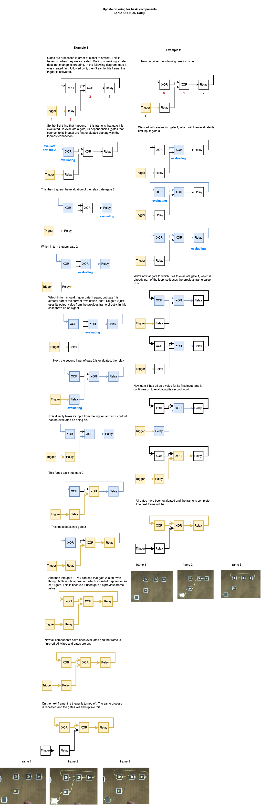

It's not yet fully understood how exactly the game calculates logic updates each frame, but the basics are mostly known. The game runs at 30Hz, so logic updates 30 times per second.

## Gate update order

### Microchips

Microchips (and sequencers) are weird and I don't understand how their update order works yet. More research is needed. For reducing update latency in a microchip you can use a [frelay](/wiki/control-flow/README.md#f-relay).

### Testing update order

The following circuit can be used to experimentally observe which gate was updated first in a frame:

The circuit compares two gates and shows which of the two was updated first. In this case, an AND gate is being compared to a red tag. The point in the series of buffers where the value changes each frame shows which gate was updated first. In this case, the first buffer is on but the second and third buffers are off, meaning the value changed between the first and the second buffer. This is where the connection to the AND gate exists, therefore the AND gate was updated first in the frame and the red tag was updated second.

To use this testing circuit, you must always re-place the top four gates in the loop after placing the two gates at the bottom that are to be tested. This is because gates are updated oldest first, so the top four gates must be newer than the bottom two to ensure that they do not get updated first and break the experiment.

## Update phases

My current theory for how logic updates work is that there are distinct "phases" each frame.

### Tags

The first phase is tags. Tags update their signal values to whatever values are being sent into their inputs. Tag sensors update their output values according to the values of the tags around them.

Tags and tag sensors can update together in a frame in any order, depending on how they were placed/created. So with the right placement order you can have a series of tags and tag sensors that propagate a value in a single frame. Example:

The above example shows the analog value 40.68 propagating through multiple tags instantly. This only works if the tags and tag sensors have been created in the correct order. The tag update phase handles direct connections from tag sensors to tags as above, but it does _not_ propagate values if other logic gates are in between. Example:

The buffer gates above will only be updated in the next phase, and so values cannot pass through them during the tag phase.

### Logic

The second phase is other logic gates.

### Physics

The last phase is physics. Logic components that physically move objects like movers and followers take effect now.

Note that if you pause the game, if an object is moving, then the location that it appears to be will be different to its location at the start of the frame when tag updates were executed.

## Specific gate priorities

TODO
