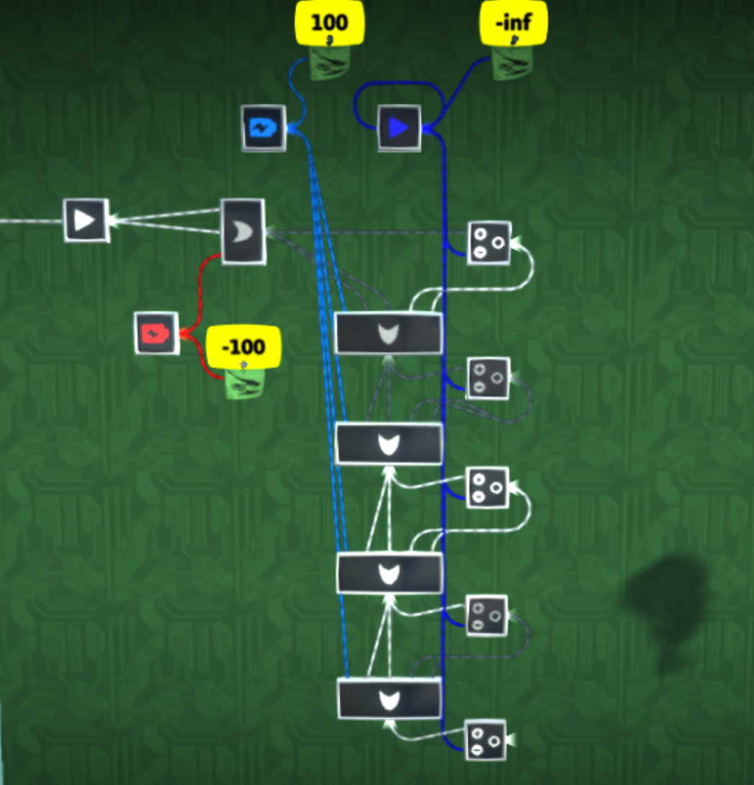

# Analog conversions

## Digital to analog combiner/encoder

Up to 24 bits can be encoded into a single analog value using a digital to analog combiner circuit as shown:

Repeat the pattern for as many bits as needed. The orange battery is 50%. Note that the input bits are interpreted as being on if they have an analog value of 100% and off if it is 0%. Their digital value is not relevant.

## Pure analog splitter/decoder

 TODO

## Basic analog to digital splitter/decoder

 TODO

## 2-gate analog to digital splitter/decoder

_Credit to @spagtwo for this invention._

Using a direction combiner in angleify mode, it is possible to split up to a 24-bit analog signal into digital using only 2 gates per bit. That means for a full 24-bit analog signal, only 48 gates (plus some batteries) are needed to extract the signal to digital again. This requires a [signal with a `-inf` value](/wiki/game-mechanics/gate-behavior/README.md#inf-nan-and-illegal-values).

In the following image, the OR gates are in add mode and the direction combiners are in angleify mode with `-inf` in their bottom inputs.

## Greater than 24-bit splitter/decoder

 TODO

## Analog bitshifting

 TODO
