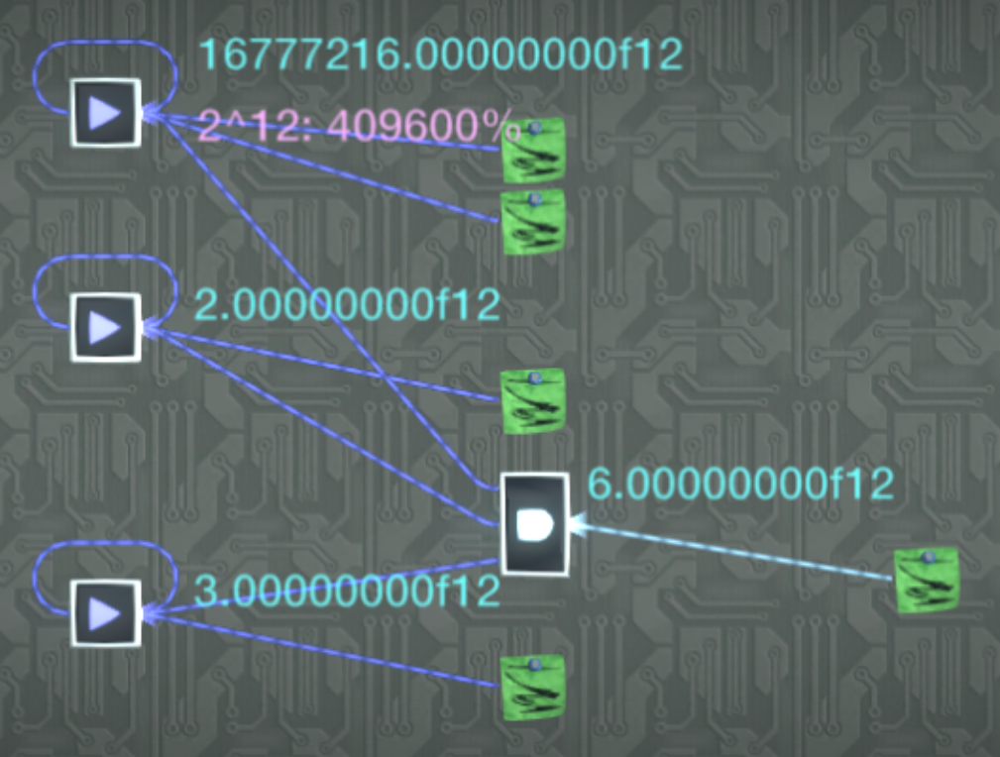
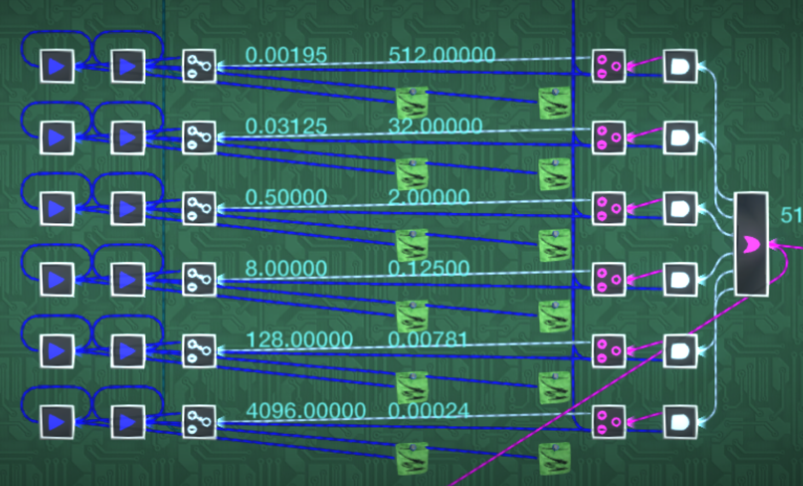
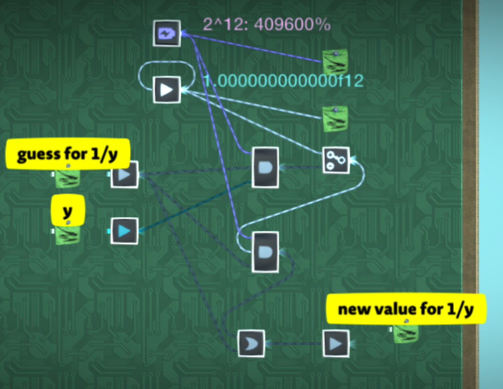
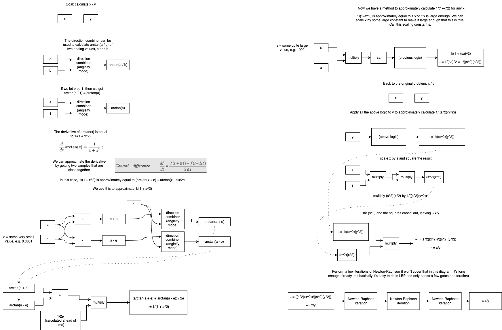
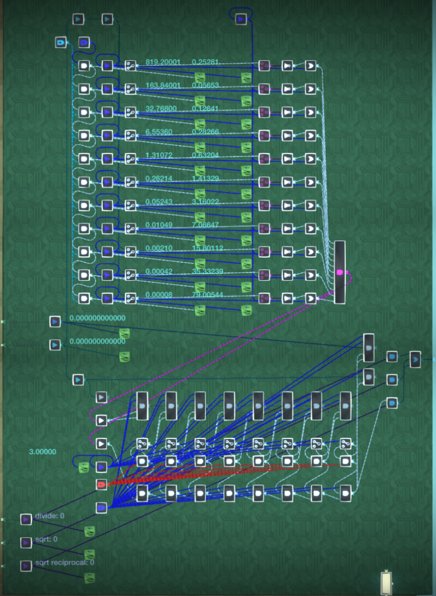

# Analog float arithmetic

These arithmetic operations can be performed on [fixed point / scaled floating point values](/wiki/computing-components/analog-value-representations/README.md#fixed-point).

## Addition and subtraction

Addition and subtraction can simply be done with OR gates or direction combiners, assuming you don't need to handle overflow.

## Multiplication

To multiply two fixed point values, use an AND gate in multiply mode with three inputs. One for each value to multiply, and one which is 2n, with `n` being the exponent used for the fixed point represenation you're using. This requires using [analog values greater than 100%](/wiki/game-mechanics/gate-behavior/README.md#inf-nan-and-illegal-values).

Example of two f12 values being multiplied:

## Iterative division

An analog value can be efficiently divided by another using the [iterative method](https://en.wikipedia.org/wiki/Iterative_method).

To divide `x` by `y`, you first calculate the reciprocal of `y`, `1/y`, and then multiply that by `x`. The reciprocal can be initially guessed using a lookup table and then iteratively improved.

### Lookup table

This is an example of a lookup table for calculating `1/y` for an f12 value. The value of `y` is compared to each index value (on the left, 0.00195, 0.03125 etc.). If `y` is less than that index value, then its reciprocal value (on the right, 512.0, 32.0 etc.) is used as an initial guess for `1/y`.

So for example, an input of `y = 1000.0` will give a guess of `1/y ~= 0.00024`. An input of `y = 2.3` will give `1/y ~= 0.125`.

### Iteration

Once an initial guess for `1/y` is obtained, it can be improved using a formula that reduces the error.

Let `g1 = initial guess for 1/y` and `g2 = new, better guess for 1/y`, then one such formula is `g2 = g1 + (g1 * (1 - (g1 * y)))`. Implemented below for f12 values:

### Divider

Chain enough of these iterations together to get sufficiently high accuracy, and then finally multiply the resulting value for `1/y` by `x` to get `x/y`.

A complete circuit implementing division this way for f12 values:

## Arctan division

The direction combiner in angleify mode provides a way to calculate `arctan(x)`. This can be used to calculate an approximate value for `1 / x`:

This is impractical though since using a lookup table and the iterative method is simpler and cheaper.

## Square roots

There is a variant of the [Newton-Raphson method](https://en.wikipedia.org/wiki/Newton's_method) for calculating `1/sqrt(x)` called [Goldschmidt's algorithm](https://en.wikipedia.org/wiki/Methods_of_computing_square_roots#Goldschmidt's_algorithm). Because `x * 1/sqrt(x) = sqrt(x)` and `1/sqrt(x)^2 = 1/x`, this approach can also be used for calculating square roots and division all with the same circuit, making it very powerful. [This post](https://cs.stackexchange.com/questions/113107/finding-square-root-without-division-and-initial-guess) explains how the algorithm works.

This algorithm is particularly good for LittleBigPlanet compared to other approaches because it only uses multiplication in its iterations, no division.

A lookup table combined with multiple iterations can be used like in the divider above. The following circuit uses Goldschmidt's algorithm to calculate `sqrt(y)`, `1/sqrt(y)`, and `x/y` for f12 values:

Note that the initial guess must be very accurate, so you may need a large lookup table. This means it is worthwhile spending time optimizing the values in the table to make it as small as possible. I used a script to generate the values here, but it can likely be optimized even further.

## Trigonometric functions

### Sin, cos, tan

Sine can be calculated using the wave generator, but this incurs a 1-frame delay. To calculate sine instantly, you can use an approximation method like [this one](https://androidcalculator.com/how-do-calculators-compute-sine/), implemented below:

This works by using a Chebyshev polynomial to approximately calculate `sin(x)` for any `x` in the range of 0 to π/2. Values between π/2 and 2π can then be calculated by mirroring this function.

To accept values greater than 2π, you will need to divide the input value by 2π and use the remainder. You can use an analog integer divider for this.

To calculate `cos(x)`, do `sin(π/2 - x)`.

`tan(x)` can be calculated with `sin(x) / cos(x)`, but there's probably a more efficient way to do it directly.

### Asin, acos, atan

`atan(x)` can be calculated using the direction combiner in angleify mode.

TODO

## Exponents and logarithms

TODO
