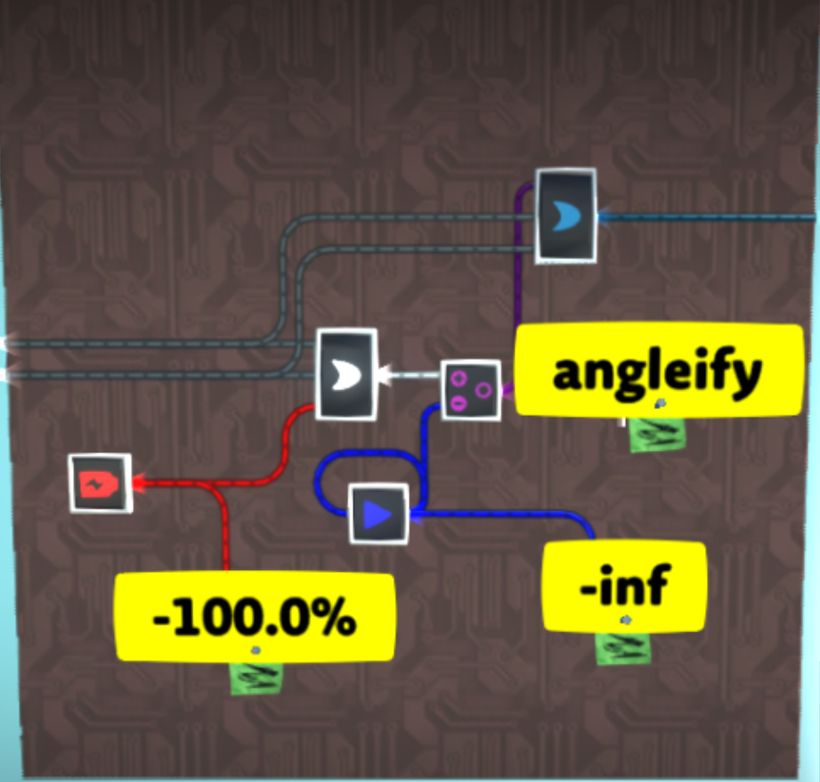
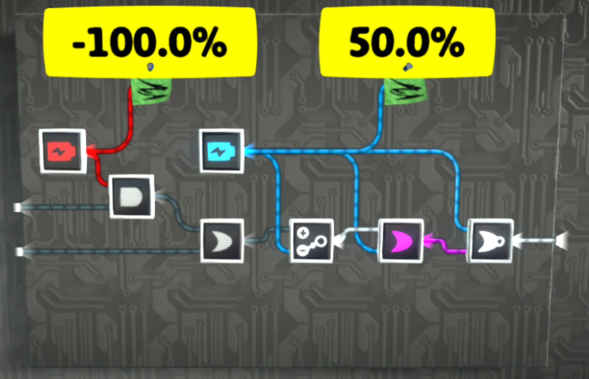
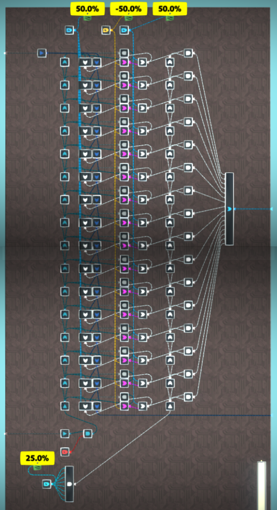
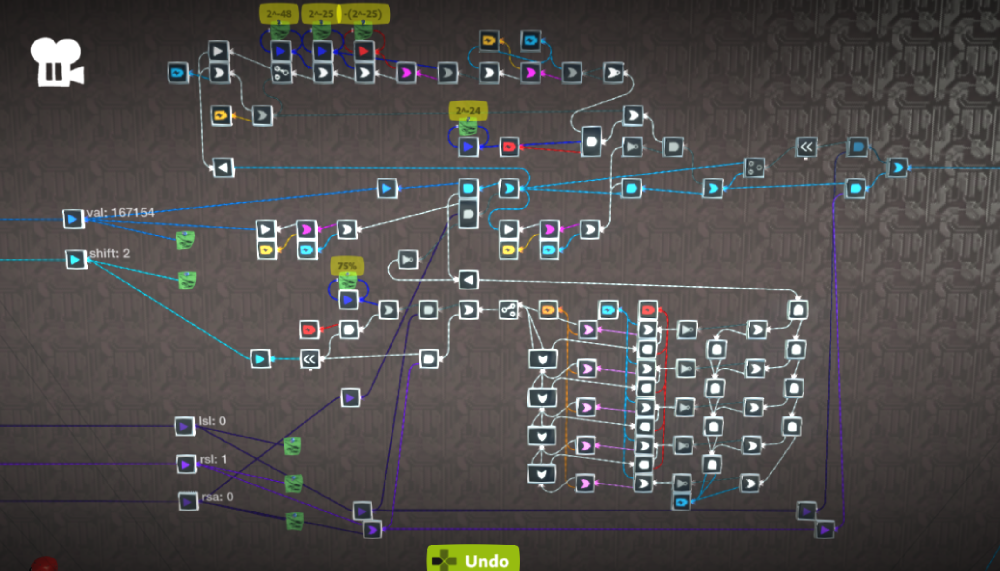

# Analog integer arithmetic

## Addition and subtraction

TODO

An analog adder with support for overflow using a Holy Cow converter:

The input order on the blue OR gate is important.

## Comparisons

### Basic analog equality

A circuit to check for equality between two analog signals:

The pink OR gate is in max value mode. The other OR gates are in add mode. The AND gate is in add mode. This will work for positive and negative analog values. It will output an analog value of 100% if the values are equal, 0% otherwise.

### Inf direction combiner equality

A more efficient equality checker can be built with a [Holy Cow converter](/wiki/computing-components/analog-conversions/README.md#holy-cow-converter).

The pink direction combiner is in angleify mode, the others in combine mode. It will output a digitally on signal with an analog value of 100% if the values are equal, 0% and digitally off otherwise.

## Multiplication

TODO

## Division

16-bit analog divider:

The top output is the quotient. The bottom output is the remainder. This design can be adapted for any word size up to 24 bits. Ensure the AND gate with the battery at the bottom is outputting a value of 1 for the word size you're using. In this example, the word size is 16 bits so a value of 2-16 is needed, which is equal to 0.258 hence the 8 inputs into the AND gate.

A more efficient design could be built using Holy Cow converters.

## Arbitrary bitshifting

TODO

24-bit analog bitshifter:

Orange batteries are -50%, red -100%, blue 50%.

If you have access to values >100% then the shifting microchips can be replaced with direct multiplication and the 5-bit splitter can be replaced with one using Holy Cow converters.
