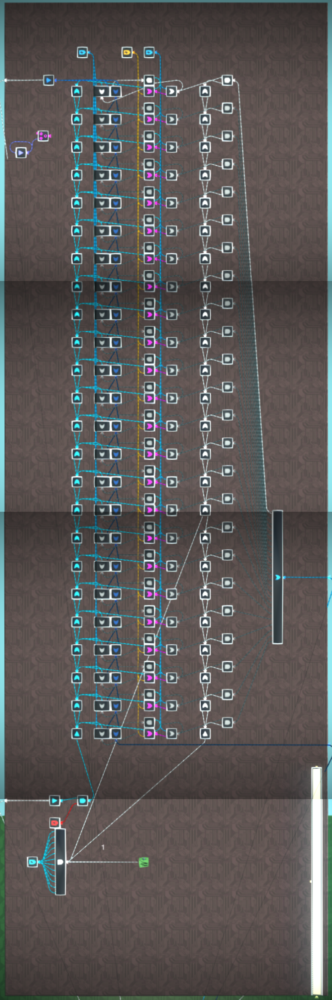
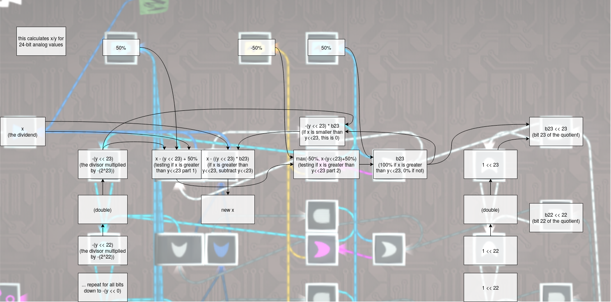

# Analog integer arithmetic

## Addition and subtraction

TODO

An analog adder with support for overflow using a Holy Cow converter:

The input order on the blue OR gate is important.

## Comparisons

### Basic analog equality

A circuit to check for equality between two analog signals:

The pink OR gate is in max value mode. The other OR gates are in add mode. The AND gate is in multiply mode. This will work for positive and negative analog values. It will output an analog value of 100% if the values are equal, 0% otherwise.

### Inf direction combiner equality

A more efficient equality checker can be built with a [Holy Cow converter](/wiki/computing-components/analog-conversions/README.md#holy-cow-converter).

The pink direction combiner is in angleify mode, the others in combine mode. It will output a digitally on signal with an analog value of 100% if the values are equal, 0% and digitally off otherwise.

## Multiplication

TODO

## Division

24-bit analog divider:

The top output is the quotient. The bottom output is the remainder. This design can be adapted for any word size up to 24 bits. Ensure the AND gate with the battery at the bottom is outputting a value of 1 for the word size you're using. In this example, the word size is 24 bits so a value of 2-24 is needed, which is equal to 0.2512 hence the 12 inputs into the AND gate.

This divider works by using [binary long division](https://en.wikipedia.org/wiki/Division_algorithm#Integer_division_(unsigned)_with_remainder). To calculate the `x/y`, it repeatedly subtracts `y` bitshifted left by gradually smaller amounts, starting with `x - (y << 23)` and ending with `x - (y << 0)`. Each time a subtraction is attempted, if the result is greater than or equal to 0, the corresponding bit in the quotient is set to 1. Otherwise it is set to 0. The remainder is what is left of `x` after all the subtractions have been attempted.

## Arbitrary bitshifting

TODO

24-bit analog bitshifter:

Orange batteries are -50%, red -100%, blue 50%.

If you have access to values >100% then the shifting microchips can be replaced with direct multiplication and the 5-bit splitter can be replaced with one using Holy Cow converters.
