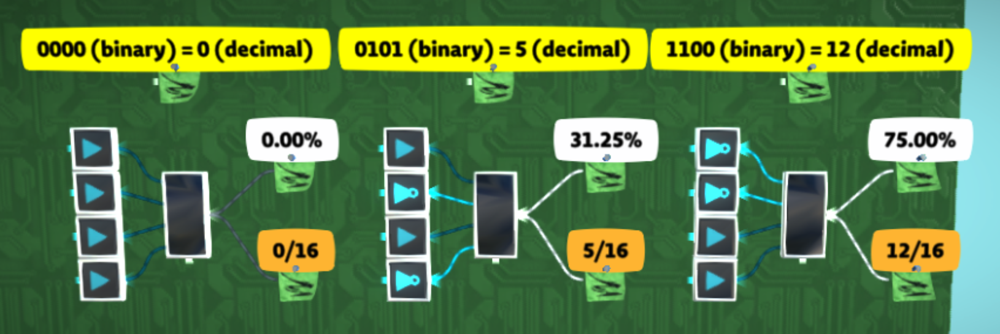

# Analog value representations

TODO

## Fixed point

You may want to do operations on actual floating point numbers (reals) that can represent fractional values. For example, for division or trigonometric functions. The problem with using analog values directly here is that they cannot represent values larger than 1.0 because of capping.

To get around this, analog values can be interpreted as being equal to their literal 32-bit floating point value in the game multiplied by some power of two, for example 224. If you do not truncate bits below 2-24, then these values can represent real numbers and not just integers. My personal convention is to refer to these representations as `f<n>` where n is the power of two being used. 224 would be `f24`.

| analog value | percentage  | interpreted as f24 | interpreted as f12 | binary                                      |
| ------------ | ----------- | ------------------ | ------------------ | ------------------------------------------- |
| 1.0          | 100%        | 16777216.0         | 4096.0             | 0b1.0                                       |
| 0.5          | 50%         | 8388608.0          | 2048.0             | 0b0.1                                       |
| 0.01         | 1%          | 167772.16          | 40.96              | 0b0.000000_101000_111101_011100             |
| 0.0007669904 | 0.07669904% | 12867.96350        | 3.1415927          | 0b0.000000_000011_001001_000011_111101_1011 |

This is kind of like [fixed point arithmetic](https://en.wikipedia.org/wiki/Fixed-point_arithmetic), except that values can go lower than 24 bits past the decimal point, and only 24 bits of precision can be held at a time. It's like a mix of fixed point and floating point.

See [analog float arithmetic](/wiki/computing-components/analog-float-arithmetic/README.md) for information on how to perform operations on these values like multiplication and division.
