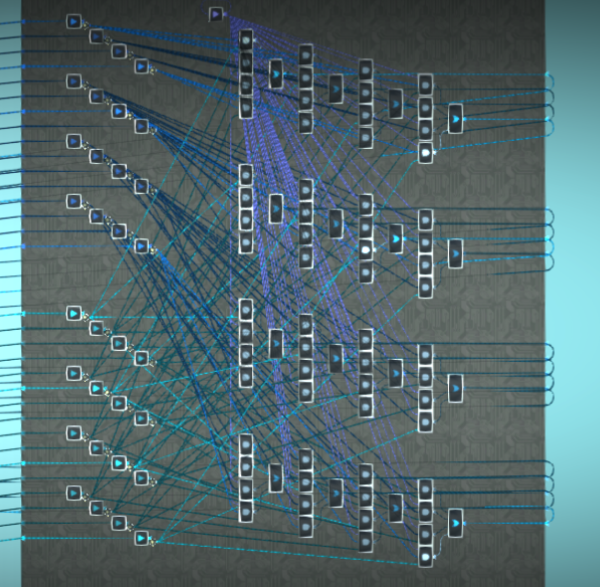

# 3D Graphics

LittleBigPlanet logic is just barely powerful enough to do some basic wireframe 3D graphics, kind of like the 1980 game [Battlezone](https://en.wikipedia.org/wiki/Battlezone_%281980_video_game%29).

For this section it is recommended that you have a basic understanding of how 3D graphics rendering is done. If not, there are plenty of tutorials online such as [this one](https://www.opengl-tutorial.org/).

## Vectors and matrices

A 3D point in space can be represented in-game as a vector of three analog values, for x, y, and z coordinates respectively.

### Matrices

4x4 matrices can be represented in-game as 16 analog values. They can be multiplied together using [analog value multplication](/wiki/computing-components/analog-float-arithmetic/README.md#multiplication).

A 4x4 matrix multiplier circuit:

TODO

## Translations

## Rotations

TODO

## Projections

TODO

## Rendering a cube

TODO

## Back-face culling

https://en.wikipedia.org/wiki/Back-face_culling

TODO
