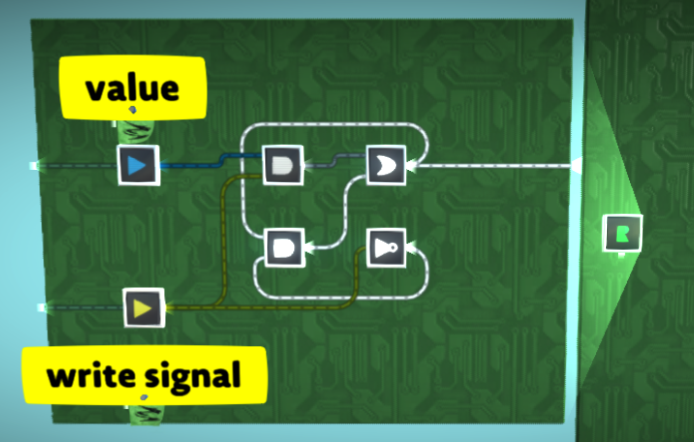

# Analog memory

It is possible to store data in analog values in signals to get much more efficiency storage than would be possible storing bits individually.

## Registers

Registers can be used to store a single analog value that can be read from and written to instantly.

## Single channel

TODO

## Dual channel and double-words

TODO

## Byte packing

TODO
