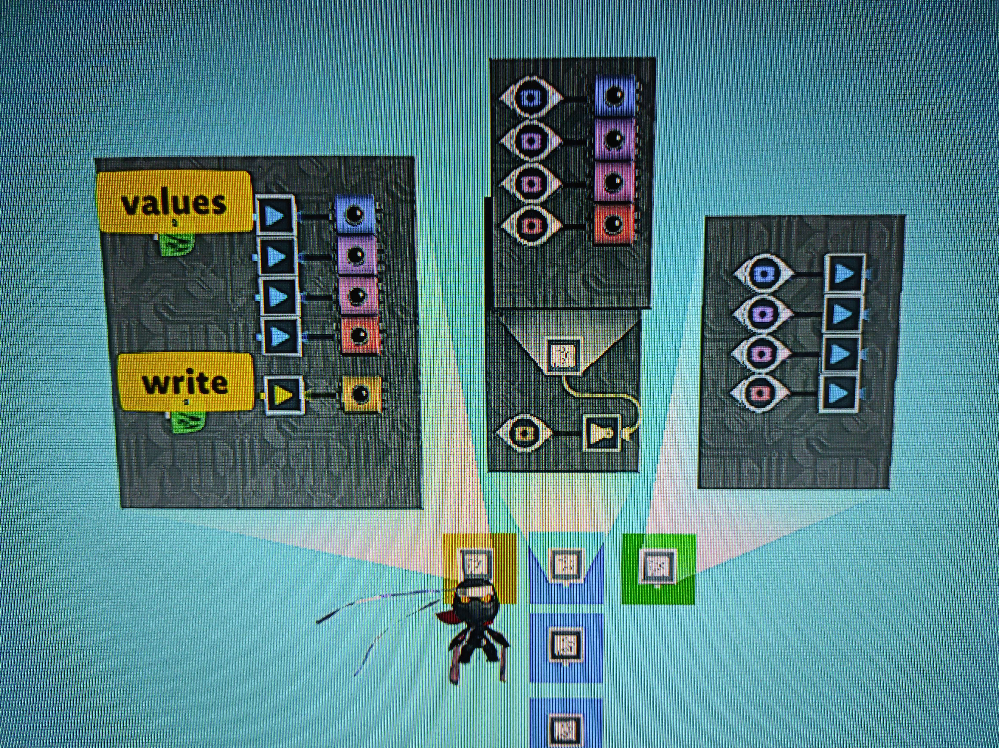

# Tag memory

Tag memory is a method of storing analog values by trapping them in a tag connected to a tag sensor for that tag. It offers greater thermometer efficiency over more basic analog memory storage techniques, at the cost of higher latency and increased complexity. It also cannot be placed entirely on a microchip; it involves moving parts and takes up physical space.

Using the right optimizations and a sufficiently advanced memory controller, it is possible to create tag memory that can read and write with a single frame of latency. Keep in mind it is not instant though - on the frame you calculate the address of the memory to access, the read value will not actually be available until the next frame.

| Scenario                                    | Latency                   | Throughput        |
| ------------------------------------------- | ------------------------- | ----------------- |
| Read arbitrary address                      | 1 frame                   | once per frame    |
| Read address in same block as previous read | 0 frames                  | once per frame    |
| Write arbitrary address                     | 2 frames                  | once per 2 frames |
| Write arbitrary address with prewriter      | 2 frames (does not block) | once per frame    |

Tag memory has an amortized thermometer cost of 1 tag sensor + 1 tag + the wire between them per analog value. Using [current esimates of thermometer costs](/wiki/game-mechanics/gate-behavior/README.md#thermometer-values) this means 42 thermometer points per analog value, so ~71kB per level. In practice, other required components bring this down to ~30kB per level.

# Tag memory core

Create tag memory by placing a series of tag sensors connected to tags of the same color and label inside a microchip as shown:

This central microchip with the four tag sensor/tag pairs forms a block of tag memory, in this case holding four analog values. The writer is the yellow square, the reader is the green square. Multiple tag memory blocks (blue) can be placed side-by-side as shown. Followers or something else can be added to the writer and reader to allow them to move between blocks.

TODO

# Reader

TODO

# Writer

To write to a tag memory block, move the writer to the block you wish to write to and activate the yellow write tag. This will disable the microchip with the tag loops inside it, causing them to all become deactivated. You can then activate the value tags with the analog values you wish to write, storing them in the block. This will leave a period of 2 frames where the value cannot be read directly from memory.

| Frame | Action                                                | Value can be read from memory |
| ----- | ----------------------------------------------------- | ----------------------------- |
| 1     | Move writer into correct position, activate write tag | Yes                           |
| 2     | None                                                  | No                            |
| 3     | Activate value tags                                   | No                            |
| 4     | None                                                  | Yes                           |

TODO

# Prewriter

It is possible to overcome the 2 frame gap where memory can't be read and allow memory accesses every frame by using a prewriter.

TODO
