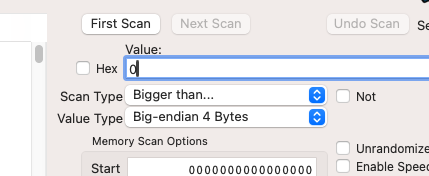

# Memory manipulation

When running LBP on RPCS3, it is possible to use external software to directly view and modify the memory of the game while it is running. This can be useful for certain logic features, such as getting an `inf` signal value for [instant analog-to-digital conversion](/wiki/computing-components/analog-conversions/README.md#2-gate-analog-to-digital-splitterdecoder).

## Cheat Engine

Cheat Engine can be downloaded [here](https://www.cheatengine.org/). The website looks sketchy and your antivirus software might complain. Don't worry, it's safe.

### Setup

Check the `MEM_MAPPED` box in Scan Settings if it isn't already enabled:

Scan for the RPCS3 process:

Set the value type to search for to be a 4-byte big-endian float or int. If you are looking for analog values, use float. This type may not be available for you depending on your OS, Cheat Engine version, or settings. Big-endian types do not work on Linux, in which case you can just use PINCE instead.

### Usage

TODO

[video](cheatengine1.mp4)

## PINCE

If you use Linux, you can use [PINCE](https://github.com/korcankaraokcu/PINCE) instead of Cheat Engine.
